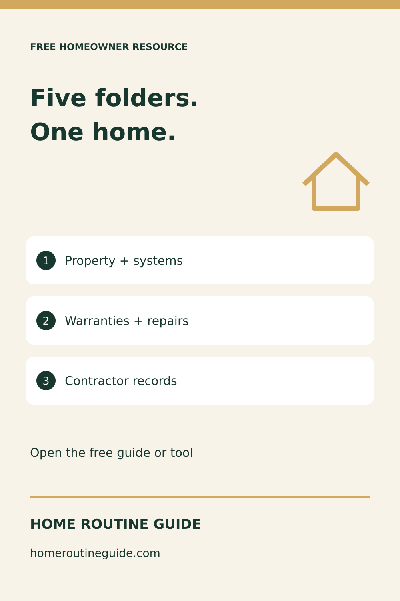
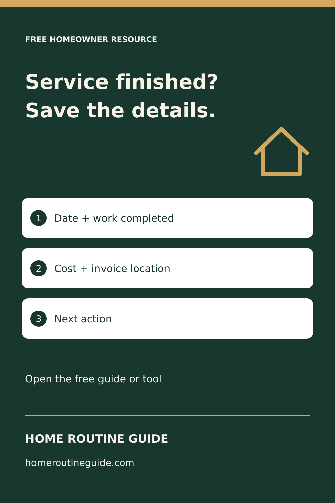
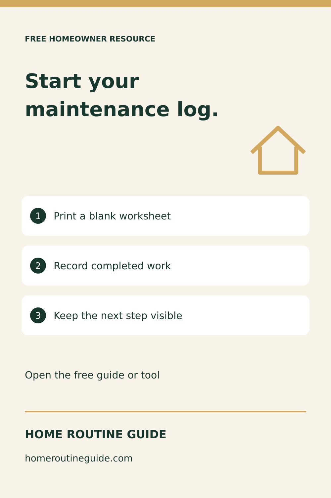
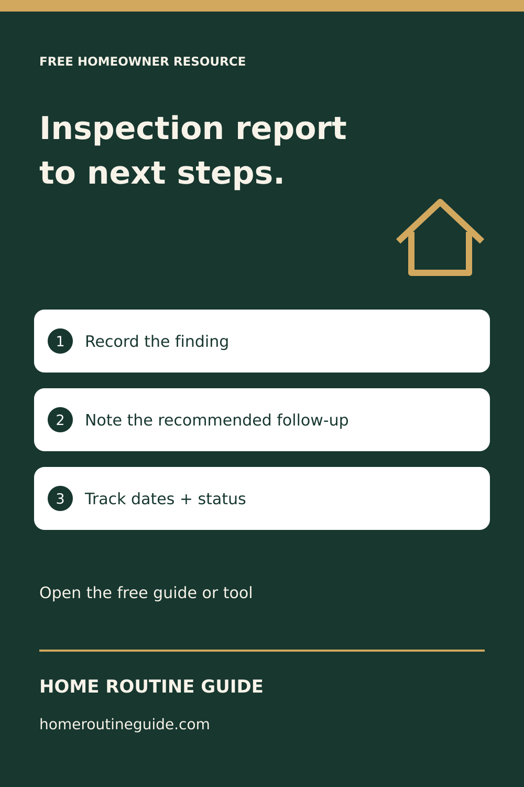
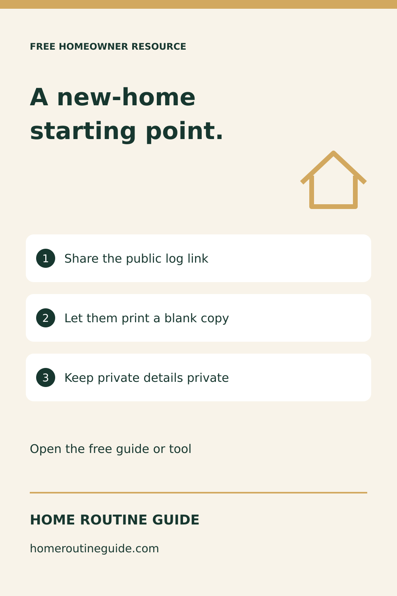

# Home records campaign — September 7, 2026

Prepared assets only: not published or scheduled. All five PNGs are 1000 × 1500. Native vector artwork; no AI-generated people, photographs, or testimonials. Destination pages are existing free resources.

## Five Folders for Your New Home Records

Description: Start organizing your new home with five practical record categories. Read the free checklist, keep private records secure, and use the worked example to start your own log.

Target: https://homeroutineguide.com/home-maintenance-records-to-keep.html#records-checklist

Image brief: 1000 by 1500 pixels. Home Routine Guide branding only. Cream background, five overlapping forest-green folder tabs, large two-line title above three white record-category cards. Gold dividers; no actual household documents. Forest #17372f, cream #f8f3e9, gold #d2a85f; generous margins and legible text.

Alt text: Home Routine Guide: Five folders. One home. Property + systems; Warranties + repairs; Contractor records. Free guide or tool.

## Your First Home Service Record: What to Write

Description: Not sure what belongs in a maintenance entry? Follow a clearly fictional example that connects completed work, cost, supporting documents, and the next action. Free homeowner guide.

Target: https://homeroutineguide.com/home-maintenance-records-to-keep.html#first-record

Image brief: 1000 by 1500 pixels. Home Routine Guide branding only. Forest-green background, cream receipt outline with blank lines, three pale cards for the log fields. Make the heading prominent; do not invent a real invoice or service claim. Forest #17372f, cream #f8f3e9, gold #d2a85f; generous margins and legible text.

Alt text: Home Routine Guide: Service finished? Save the details. Date + work completed; Cost + invoice location; Next action. Free guide or tool.

## Free Printable Home Maintenance Log — No Signup

Description: Open the free blank home maintenance log and print it for service dates, completed work, costs, document references, and follow-up. No signup required for the blank log.

Target: https://homeroutineguide.com/home-maintenance-log-printable.html#blank-log

Image brief: 1000 by 1500 pixels. Home Routine Guide branding only. Cream background, forest-green ruled-sheet motif, three white checklist rows, small FREE BLANK LOG label. Do not depict the paid binder or imply the full product is free. Forest #17372f, cream #f8f3e9, gold #d2a85f; generous margins and legible text.

Alt text: Home Routine Guide: Start your maintenance log. Print a blank worksheet; Record completed work; Keep the next step visible. Free guide or tool.

## Turn Your Inspection Report Into a Follow-Up List

Description: Use the free Inspection Report Action Planner to organize findings, recommended follow-up, dates, and status without uploading your report. Follow your inspector’s guidance and seek qualified help for safety concerns.

Target: https://homeroutineguide.com/home-inspection-report-action-plan.html

Image brief: 1000 by 1500 pixels. Home Routine Guide branding only. Forest-green background, cream three-step planning cards with numbered circles, gold connecting marks. Educational planning only: no inspected-home seal or professional endorsement. Forest #17372f, cream #f8f3e9, gold #d2a85f; generous margins and legible text.

Alt text: Home Routine Guide: Inspection report to next steps. Record the finding; Note the recommended follow-up; Track dates + status. Free guide or tool.

## Know Someone Who Just Moved? Share a Free Home Log

Description: Help a new homeowner start a useful maintenance record with this free public worksheet link. Share the link, not a completed log containing private household information. No partnership or redistribution license is implied.

Target: https://homeroutineguide.com/home-maintenance-log-printable.html#blank-log

Image brief: 1000 by 1500 pixels. Home Routine Guide branding only. Cream background, forest-green house outline and simple link symbol, three clear sharing steps. No realtor logos, personal names, partnership claims, or screenshots of completed records. Forest #17372f, cream #f8f3e9, gold #d2a85f; generous margins and legible text.

Alt text: Home Routine Guide: A new-home starting point. Share the public log link; Let them print a blank copy; Keep private details private. Free guide or tool.

## Non-Pinterest referral preparation

Draft destination: https://homeroutineguide.com/resources.html#share — do not distribute this anchor until PR #13 is merged and verified live.

Suggested resource-list copy: Home Routine Guide offers free first-month guidance, a blank maintenance log, and a home-records checklist. Start with a public resource and keep completed household records private. The optional paid binder has separate household-use terms.

No outreach or submissions have been made. No partnership, rebranding permission, or multi-client license is implied.

Primary background source: [Ready.gov financial preparedness](https://www.ready.gov/financial-preparedness), reviewed September 7, 2026, for gathering and safeguarding important records. This campaign does not provide financial, legal, or inspection advice.
