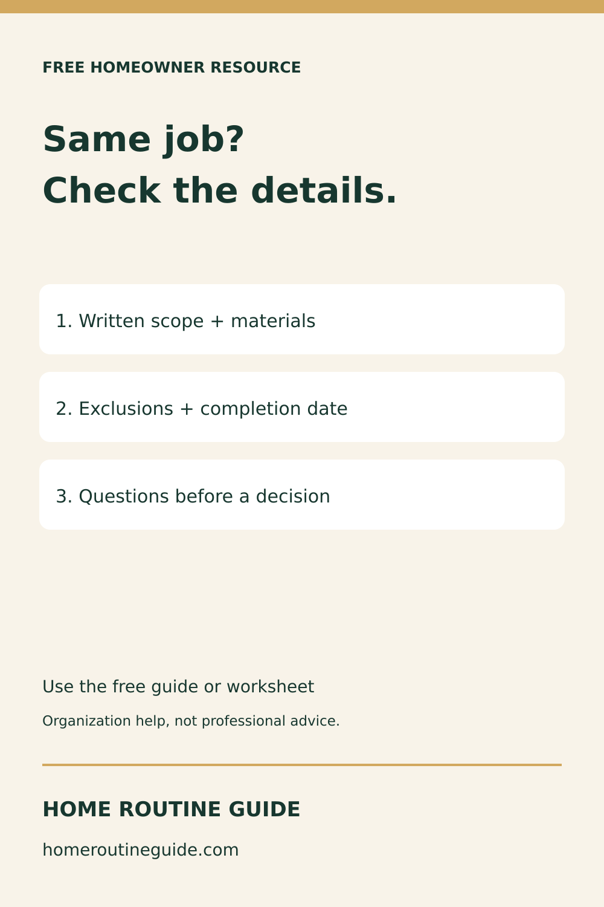
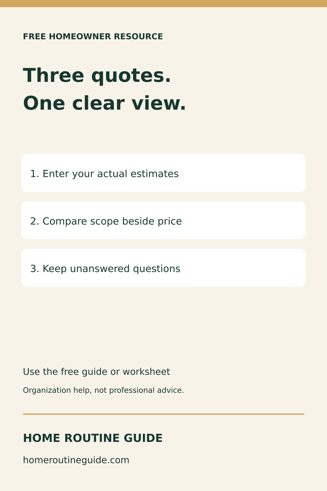
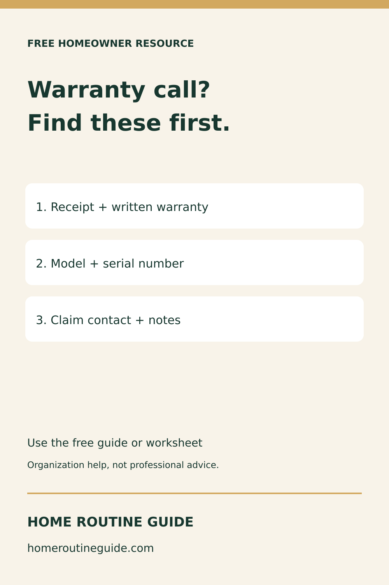
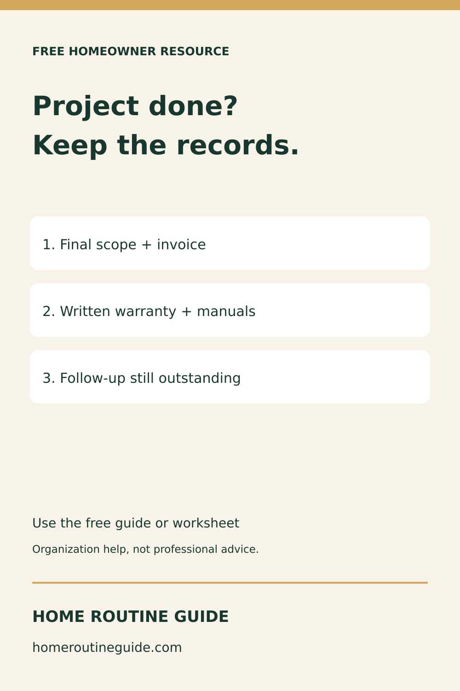
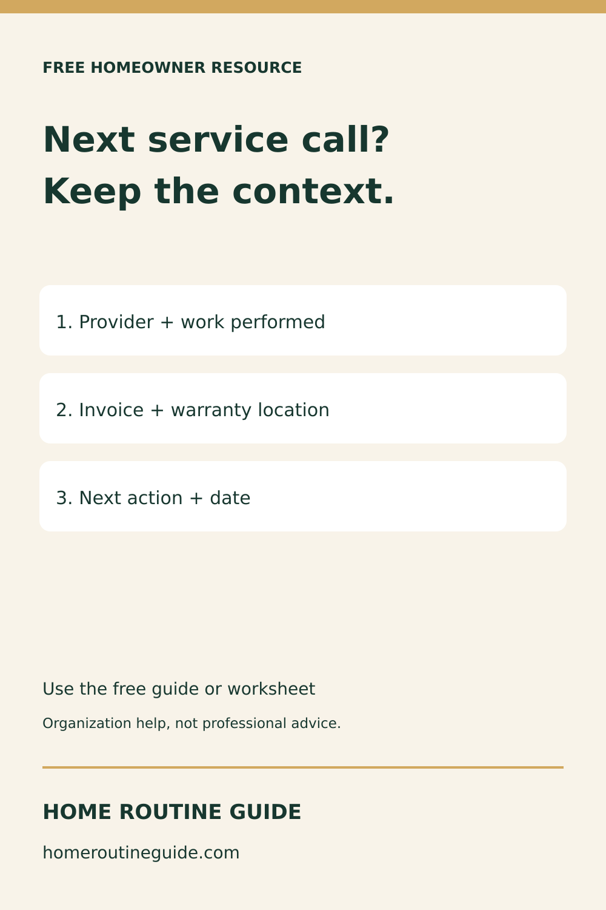

# September 21 Pinterest resources

Prepared only, not posted. Five original 1000×1500 PNG/SVG cards. Existing campaign manifests were checked; these are fresh angles and designs. No account connection is implied.

## Before Comparing Contractor Prices, Check These Details

Compare what each written estimate includes before comparing the totals. Use the free homeowner guide to organize scope, materials, exclusions and questions. A worksheet does not verify or recommend a contractor.

Target: https://homeroutineguide.com/how-to-compare-contractor-estimates.html

Alt: Home Routine Guide: Same job? Check the details. Written scope + materials; Exclusions + completion date; Questions before a decision. Free educational resource.

Production brief: 1000 by 1500 pixels. Cream #f8f3e9, forest #17372f, gold #d2a85f. Large two-line headline: Same job? / Check the details.. Three numbered white cards: Written scope + materials / Exclusions + completion date / Questions before a decision. Home Routine Guide and homeroutineguide.com footer; 65px minimum safe margin. No personal records, partner logos, endorsements, price or product mockup.

## Three Contractor Quotes, One Clear Comparison

Use the free browser tool to place three estimates side by side. Record your own figures and written scope; do not assume the cheapest quote covers the same work. Review the contractor and agreement independently.

Target: https://homeroutineguide.com/contractor-quote-comparison.html

Alt: Home Routine Guide: Three quotes. One clear view. Enter your actual estimates; Compare scope beside price; Keep unanswered questions. Free educational resource.

Production brief: 1000 by 1500 pixels. Cream #f8f3e9, forest #17372f, gold #d2a85f. Large two-line headline: Three quotes. / One clear view.. Three numbered white cards: Enter your actual estimates / Compare scope beside price / Keep unanswered questions. Home Routine Guide and homeroutineguide.com footer; 65px minimum safe margin. No personal records, partner logos, endorsements, price or product mockup.

## Before a Warranty Call, Find the Paperwork

Organize the records you may need before asking about warranty service. The free guide explains what to track; the written terms determine coverage, not the organizer. Keep private documents secure.

Target: https://homeroutineguide.com/home-warranty-tracker-printable.html

Alt: Home Routine Guide: Warranty call? Find these first. Receipt + written warranty; Model + serial number; Claim contact + notes. Free educational resource.

Production brief: 1000 by 1500 pixels. Cream #f8f3e9, forest #17372f, gold #d2a85f. Large two-line headline: Warranty call? / Find these first.. Three numbered white cards: Receipt + written warranty / Model + serial number / Claim contact + notes. Home Routine Guide and homeroutineguide.com footer; 65px minimum safe margin. No personal records, partner logos, endorsements, price or product mockup.

## Project Finished? Keep the Closeout Records

Use the free project worksheet to organize closeout records and remaining follow-up after a home project. Keep original documents securely and record facts you can verify. No purchase or signup required for the worksheet.

Target: https://homeroutineguide.com/home-project-planner-printable.html#worksheet

Alt: Home Routine Guide: Project done? Keep the records. Final scope + invoice; Written warranty + manuals; Follow-up still outstanding. Free educational resource.

Production brief: 1000 by 1500 pixels. Cream #f8f3e9, forest #17372f, gold #d2a85f. Large two-line headline: Project done? / Keep the records.. Three numbered white cards: Final scope + invoice / Written warranty + manuals / Follow-up still outstanding. Home Routine Guide and homeroutineguide.com footer; 65px minimum safe margin. No personal records, partner logos, endorsements, price or product mockup.

## Make the Next Contractor Call Easier to Prepare

Keep service-provider details connected to the work performed and the next step. Open the free contractor-contact worksheet, print your own copy, and keep completed records private. This is a record tool, not a contractor endorsement.

Target: https://homeroutineguide.com/home-contractor-contact-list-printable.html#worksheet

Alt: Home Routine Guide: Next service call? Keep the context. Provider + work performed; Invoice + warranty location; Next action + date. Free educational resource.

Production brief: 1000 by 1500 pixels. Cream #f8f3e9, forest #17372f, gold #d2a85f. Large two-line headline: Next service call? / Keep the context.. Three numbered white cards: Provider + work performed / Invoice + warranty location / Next action + date. Home Routine Guide and homeroutineguide.com footer; 65px minimum safe margin. No personal records, partner logos, endorsements, price or product mockup.

Primary sources reviewed September 21: [FTC contractor guidance](https://consumer.ftc.gov/articles/how-avoid-home-improvement-scam) and [FTC warranties](https://consumer.ftc.gov/articles/warranties). No claim of verified search volume or traffic.
