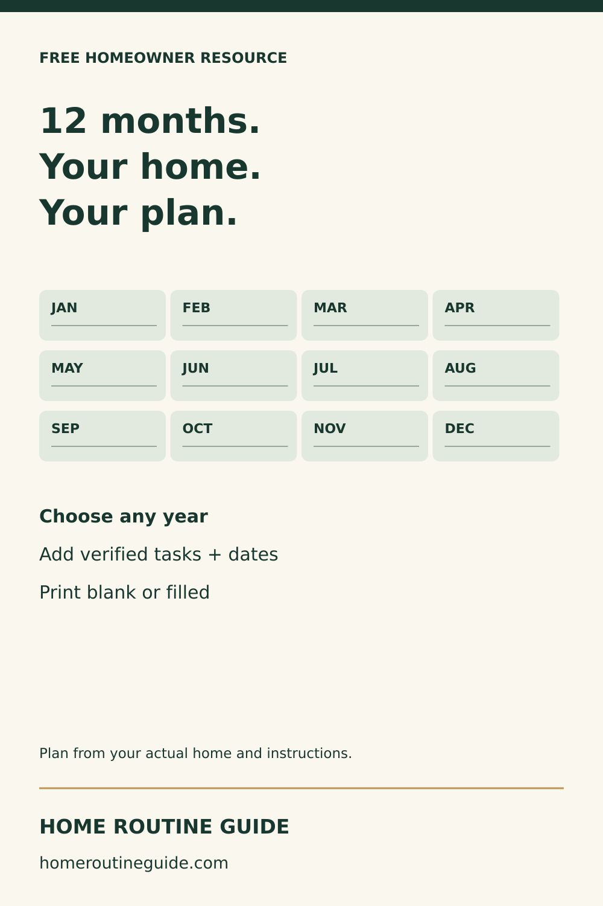
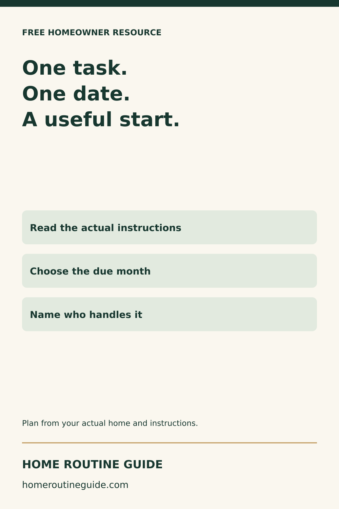
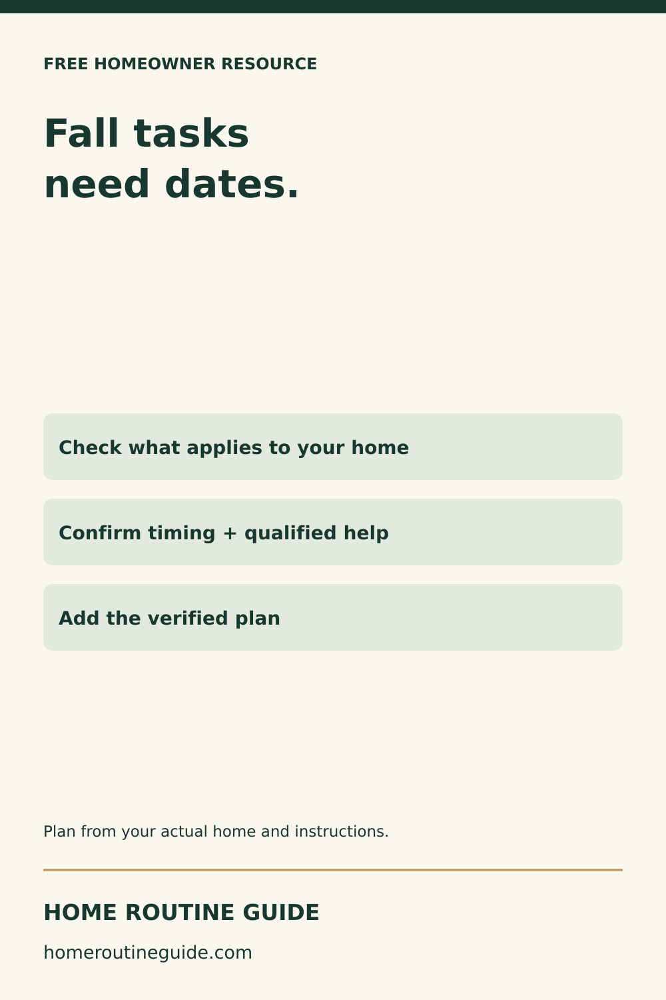
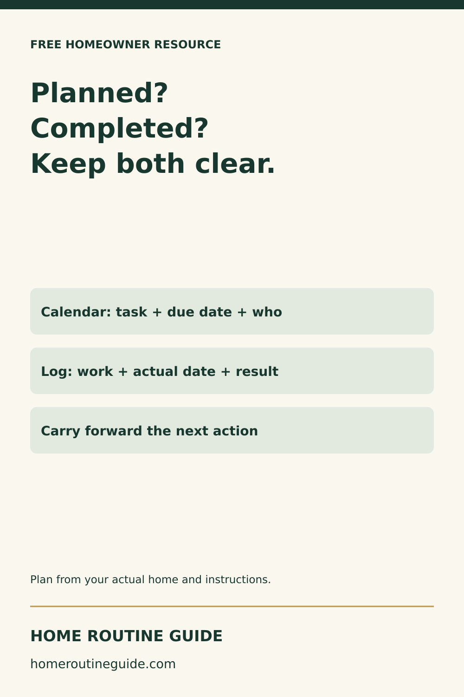
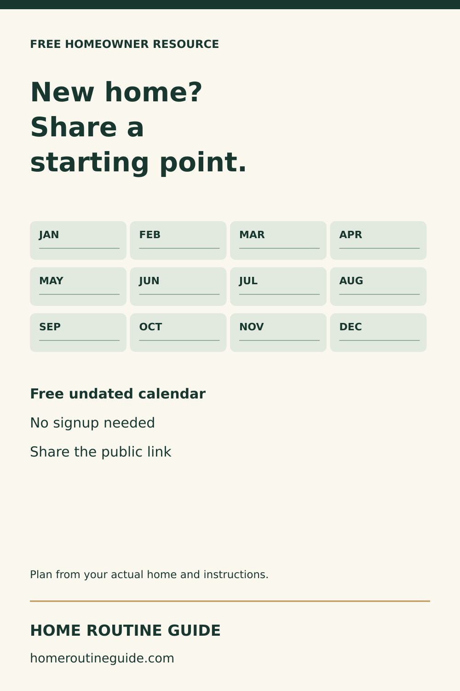

# Free-calendar Pinterest package

Five fresh 1000×1500 designs. Prepared only; publication requires a verified connected Home Routine Guide Pinterest account.

## Free 12-Month Home Maintenance Calendar Printable

Print a free undated home maintenance calendar with all 12 months. Type short notes for verified tasks, due dates and who handles them, or print a blank copy. No signup required. Entries are not saved; print or save your own PDF before leaving.

Target: https://homeroutineguide.com/home-maintenance-calendar-printable.html#calendar-worksheet

Alt: Home Routine Guide: 12 months. Your home. Your plan. Choose any year; Add verified tasks + dates; Print blank or filled.

Image brief: 1000×1500. Cream #faf7ef background, forest #17372f type, muted green cards and gold divider. Headline: 12 months. / Your home. / Your plan.. Twelve labeled month tiles in a 4×3 grid, followed by: Choose any year / Add verified tasks + dates / Print blank or filled. 65px safe margins. Brand and homeroutineguide.com footer. Original vector design; no photographs, mockups, personal information or invented results.

## Start Your Home Maintenance Calendar With One Verified Task

Build a home maintenance plan around your actual equipment and property. Start with one task whose timing you can verify, then record the month and responsible person in the free calendar. It is an organizer, not a universal service schedule.

Target: https://homeroutineguide.com/home-maintenance-calendar-printable.html#calendar-worksheet

Alt: Home Routine Guide: One task. One date. A useful start. Read the actual instructions; Choose the due month; Name who handles it.

Image brief: 1000×1500. Cream #faf7ef background, forest #17372f type, muted green cards and gold divider. Headline: One task. / One date. / A useful start.. Three stacked labeled cards: Read the actual instructions / Choose the due month / Name who handles it. 65px safe margins. Brand and homeroutineguide.com footer. Original vector design; no photographs, mockups, personal information or invented results.

## Put Your Fall Home Maintenance Plan on a Calendar

Use the fall guide for planning prompts, then add verified tasks to your free 12-month calendar. Equipment, climate and property conditions change the right schedule. The worksheet does not replace manufacturer instructions or qualified help.

Target: https://homeroutineguide.com/home-maintenance-calendar-printable.html#calendar-worksheet

Alt: Home Routine Guide: Fall tasks need dates. Check what applies to your home; Confirm timing + qualified help; Add the verified plan.

Image brief: 1000×1500. Cream #faf7ef background, forest #17372f type, muted green cards and gold divider. Headline: Fall tasks / need dates.. Three stacked labeled cards: Check what applies to your home / Confirm timing + qualified help / Add the verified plan. 65px safe margins. Brand and homeroutineguide.com footer. Original vector design; no photographs, mockups, personal information or invented results.

## Home Maintenance Calendar vs Log: Keep Both Useful

Use a calendar for planned work and a maintenance log for what actually happened. Print the free blank log to record completed work and next actions. Keep completed household records private.

Target: https://homeroutineguide.com/home-maintenance-log-printable.html#blank-log

Alt: Home Routine Guide: Planned? Completed? Keep both clear. Calendar: task + due date + who; Log: work + actual date + result; Carry forward the next action.

Image brief: 1000×1500. Cream #faf7ef background, forest #17372f type, muted green cards and gold divider. Headline: Planned? / Completed? / Keep both clear.. Three stacked labeled cards: Calendar: task + due date + who / Log: work + actual date + result / Carry forward the next action. 65px safe margins. Brand and homeroutineguide.com footer. Original vector design; no photographs, mockups, personal information or invented results.

## Share a Free Home Maintenance Calendar With a New Homeowner

Know someone settling into a home? Share the free maintenance calendar from Home Routine Guide. The resource library includes blank organization worksheets. Share public links, not private completed records; no partnership or paid-product redistribution rights are implied.

Target: https://homeroutineguide.com/resources.html#free-worksheets

Alt: Home Routine Guide: New home? Share a starting point. Free undated calendar; No signup needed; Share the public link.

Image brief: 1000×1500. Cream #faf7ef background, forest #17372f type, muted green cards and gold divider. Headline: New home? / Share a / starting point.. Twelve labeled month tiles in a 4×3 grid, followed by: Free undated calendar / No signup needed / Share the public link. 65px safe margins. Brand and homeroutineguide.com footer. Original vector design; no photographs, mockups, personal information or invented results.

Primary sources reviewed September 27, 2026:
- https://www.energystar.gov/saveathome/heating-cooling/maintenance-checklist
- https://www.cpsc.gov/Safety-Education/Safety-Education-Centers/Carbon-Monoxide-Information-Center/CO-Alarms
