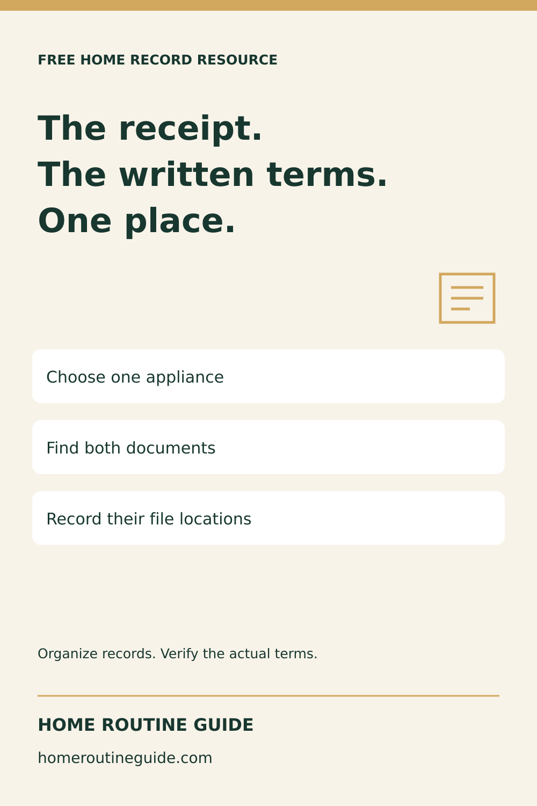
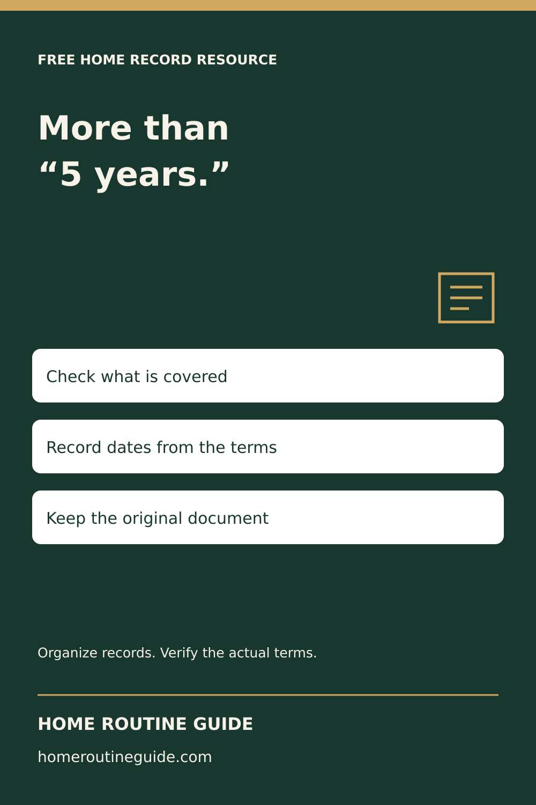
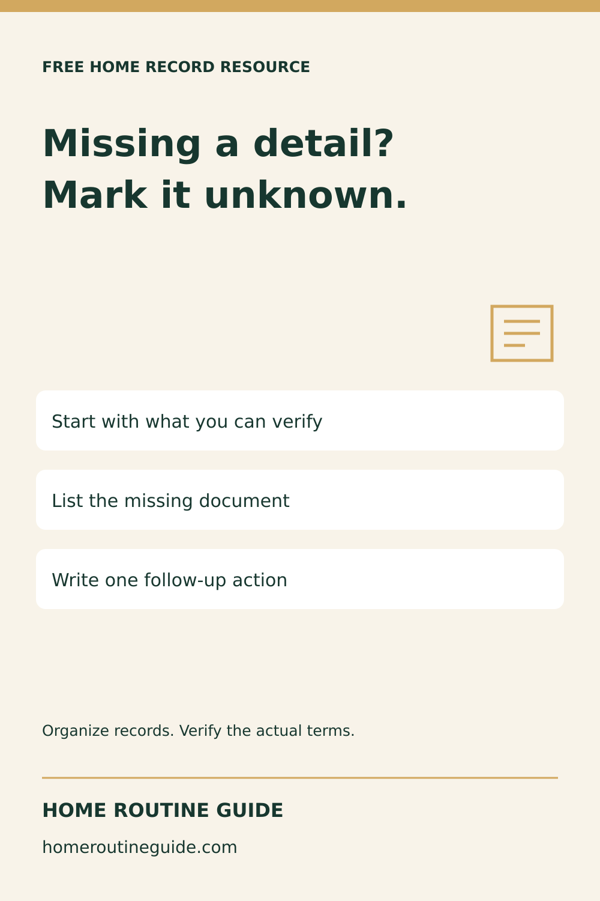
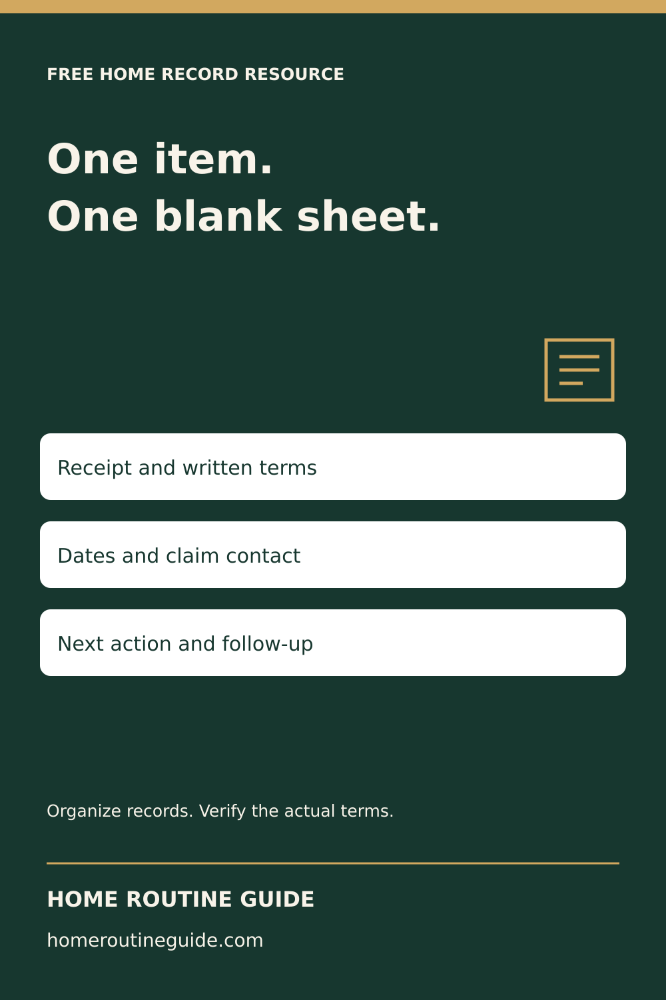
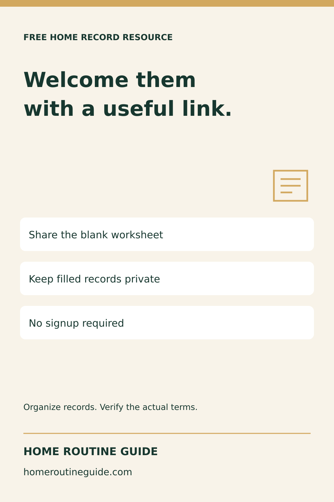

# Warranty resource campaign — October 5, 2026

Prepared, not posted or scheduled. Five fresh native-vector PNGs, 1000 × 1500. No AI-generated photos or product mockups.

## Keep the Receipt With the Warranty

Description: Start one useful home record: keep an appliance receipt with its written warranty, then use the free blank tracker to find both later. No signup required. The tracker organizes evidence; it does not confirm coverage.

Target: https://homeroutineguide.com/home-warranty-tracker-printable.html#warranty-worksheet

Alt: Home Routine Guide: The receipt. The written terms. One place. Choose one appliance; Find both documents; Record their file locations. Organize records; verify the actual terms.

Production brief: 1000 by 1500 pixels. Cream #f8f3e9 and forest #17372f, gold #d2a85f accent. Top label FREE HOME RECORD RESOURCE. Large left-aligned headline: The receipt. The written terms. One place. Three separate white instruction cards: Choose one appliance / Find both documents / Record their file locations. Small outline document icon. Footer Home Routine Guide and homeroutineguide.com. No personal data, completed records, endorsements or warranty guarantees.

## A Five-Year Label Is Not the Whole Warranty

Description: A short warranty label does not explain every condition. Record dates and any parts or labor differences from the actual written terms. Print a free blank one-item warranty tracker; no purchase required.

Target: https://homeroutineguide.com/home-warranty-tracker-printable.html#fields

Alt: Home Routine Guide: More than “5 years.” Check what is covered; Record dates from the terms; Keep the original document. Organize records; verify the actual terms.

Production brief: 1000 by 1500 pixels. Cream #f8f3e9 and forest #17372f, gold #d2a85f accent. Top label FREE HOME RECORD RESOURCE. Large left-aligned headline: More than “5 years.” Three separate white instruction cards: Check what is covered / Record dates from the terms / Keep the original document. Small outline document icon. Footer Home Routine Guide and homeroutineguide.com. No personal data, completed records, endorsements or warranty guarantees.

## Missing an Appliance Receipt? Mark It Unknown

Description: You can start organizing home maintenance records before every document is found. Mark missing dates or receipts as unknown and record a follow-up. Do not guess warranty coverage.

Target: https://homeroutineguide.com/home-maintenance-records-to-keep.html#records-checklist

Alt: Home Routine Guide: Missing a detail? Mark it unknown. Start with what you can verify; List the missing document; Write one follow-up action. Organize records; verify the actual terms.

Production brief: 1000 by 1500 pixels. Cream #f8f3e9 and forest #17372f, gold #d2a85f accent. Top label FREE HOME RECORD RESOURCE. Large left-aligned headline: Missing a detail? Mark it unknown. Three separate white instruction cards: Start with what you can verify / List the missing document / Write one follow-up action. Small outline document icon. Footer Home Routine Guide and homeroutineguide.com. No personal data, completed records, endorsements or warranty guarantees.

## Free One-Item Home Warranty Worksheet

Description: Print a blank warranty record for one appliance or agreement, then fill it by hand. No signup, purchase or software required. Keep completed household records private; this is not a coverage decision or automatic reminder.

Target: https://homeroutineguide.com/home-warranty-tracker-printable.html#warranty-worksheet

Alt: Home Routine Guide: One item. One blank sheet. Receipt and written terms; Dates and claim contact; Next action and follow-up. Organize records; verify the actual terms.

Production brief: 1000 by 1500 pixels. Cream #f8f3e9 and forest #17372f, gold #d2a85f accent. Top label FREE HOME RECORD RESOURCE. Large left-aligned headline: One item. One blank sheet. Three separate white instruction cards: Receipt and written terms / Dates and claim contact / Next action and follow-up. Small outline document icon. Footer Home Routine Guide and homeroutineguide.com. No personal data, completed records, endorsements or warranty guarantees.

## A Free Warranty Worksheet to Share With New Homeowners

Description: Add this free public warranty-tracker link to a homeowner welcome note or resource list. Share the original link, not completed records. No affiliation or paid-Binder redistribution permission is implied.

Target: https://homeroutineguide.com/home-warranty-tracker-printable.html#warranty-worksheet

Alt: Home Routine Guide: Welcome them with a useful link. Share the blank worksheet; Keep filled records private; No signup required. Organize records; verify the actual terms.

Production brief: 1000 by 1500 pixels. Cream #f8f3e9 and forest #17372f, gold #d2a85f accent. Top label FREE HOME RECORD RESOURCE. Large left-aligned headline: Welcome them with a useful link. Three separate white instruction cards: Share the blank worksheet / Keep filled records private / No signup required. Small outline document icon. Footer Home Routine Guide and homeroutineguide.com. No personal data, completed records, endorsements or warranty guarantees.

Source: [FTC Warranties](https://consumer.ftc.gov/articles/warranties), reviewed October 5, 2026. Check destinations are live and existing schedules before publishing.
