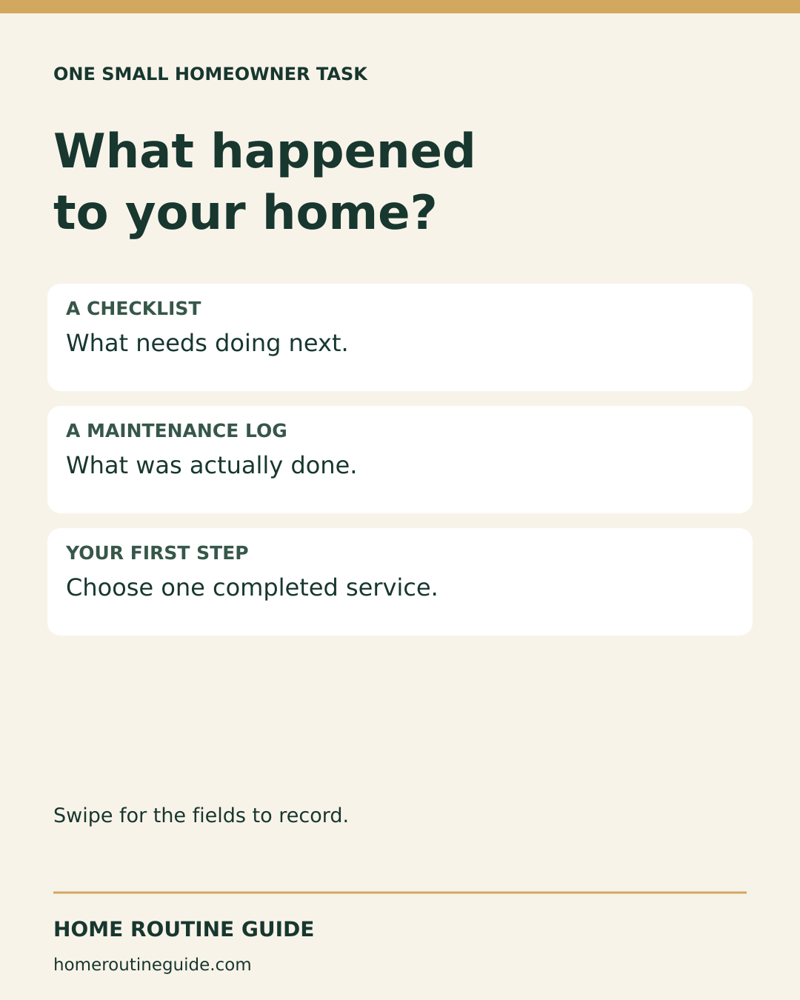
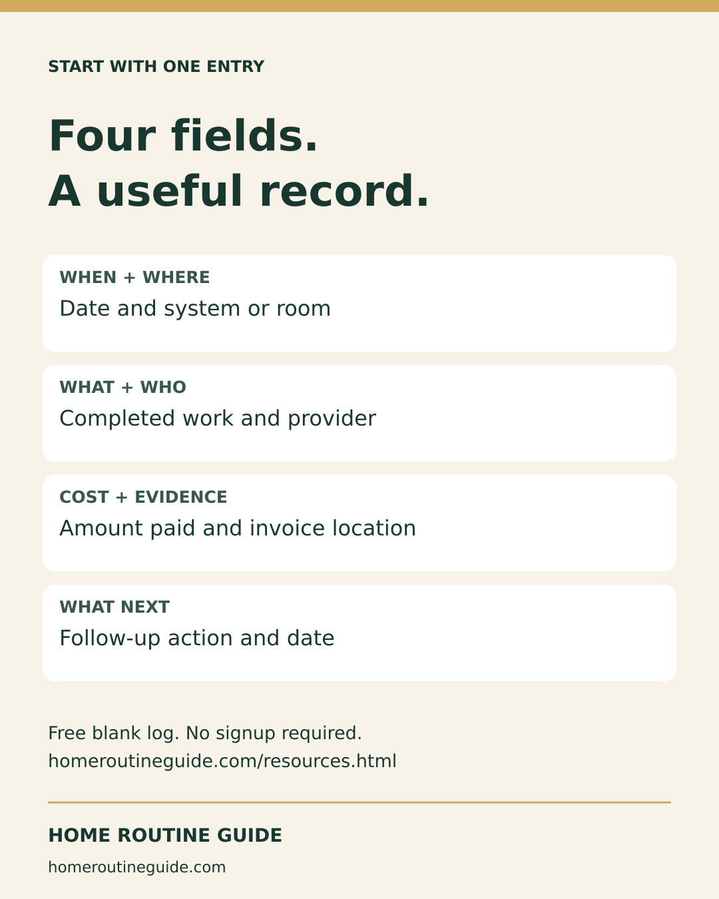
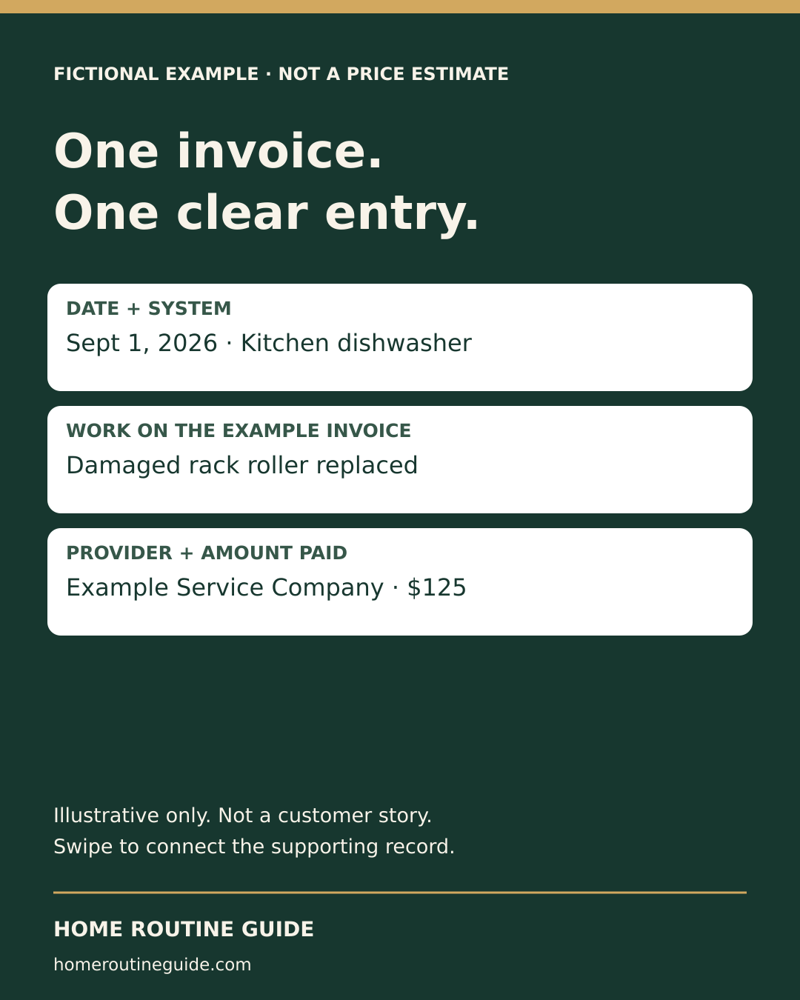
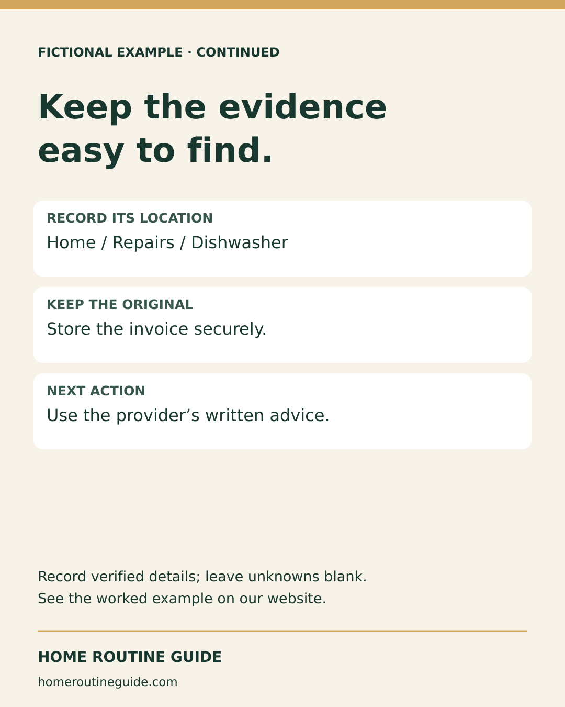
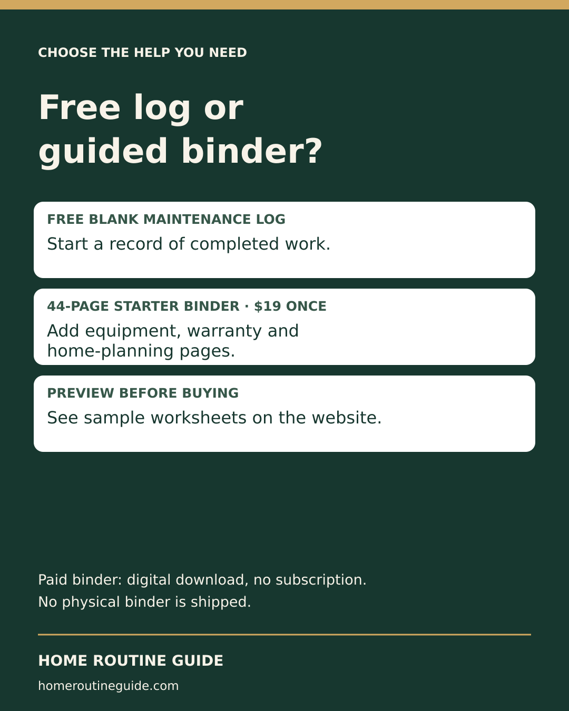

> Historical campaign archive. Do not repost the old-price comparison graphic or caption. The current offer is $9.99; use social/2026-09-18 for the corrected comparison.

# Instagram recordkeeping campaign

Five 1080 × 1350 original graphics form two educational carousels and one optional product comparison. Caption, destination, alt text and proposed date for each post are in [campaign.json](campaign.json). No customer information or real invoice is used. The service example is fictional and not a price estimate.

Artwork files and proposed dates do not establish publication. Confirm each entry in Metricool before reporting it as scheduled or published.

## 2026-09-14T10:00:00-04:00

A checklist tells you what to do next. A maintenance log tells you what actually happened.

Swipe for four fields to record after a service or repair. Start with one completed job; leave unknown details blank until verified.

Open the free blank log at homeroutineguide.com/resources.html → Printable Home Maintenance Log → Open the free blank log. Print it from your browser, or choose Save as PDF if available. No email or purchase required.

Keep original documents securely. Leave passwords, access codes and full account numbers off the sheet.

#NewHomeowner #HomeMaintenance #HomeOrganization

Destination: https://homeroutineguide.com/home-maintenance-log-printable.html#blank-log

## 2026-09-16T10:00:00-04:00

What does a useful home maintenance entry actually look like?

Swipe through this clearly fictional dishwasher-service example: date, work completed, provider, amount paid, supporting document and next action. The $125 figure is illustrative only—not a price estimate.

For your own log, copy the actual work description and follow the provider’s written instructions. The summary helps you find the evidence; keep the original documents securely.

Read the full example: homeroutineguide.com/resources.html → Home Maintenance Records to Keep. You can also open a free blank log from the guide.

#FirstTimeHomeowner #HomeRecords #HomeMaintenance

Destination: https://homeroutineguide.com/home-maintenance-records-to-keep.html#first-record

## 2026-09-18T10:00:00-04:00

Do you need the full binder, or just a maintenance log?

Start with the free blank log when you only need a history of completed service and repairs.

The optional New Homeowner Starter Binder adds 44 guided pages for home systems, equipment, warranties, contractors, maintenance, budgets and projects. One-time $19 digital download. No subscription and no physical binder shipped.

Preview the worksheets before deciding: homeroutineguide.com → Starter Binder. Checkout and digital delivery are through Kit.

Prefer the free sheet? Open Free Checklists → Printable Home Maintenance Log.

#NewHomeowner #HomeOrganization #HomeMaintenance

Destination: https://homeroutineguide.com/packages.html#preview

