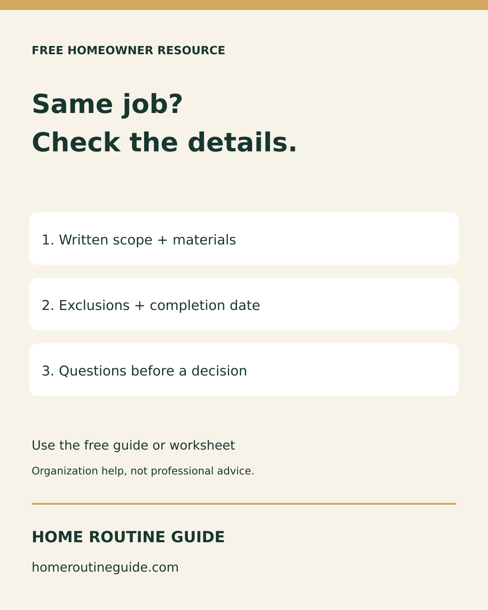
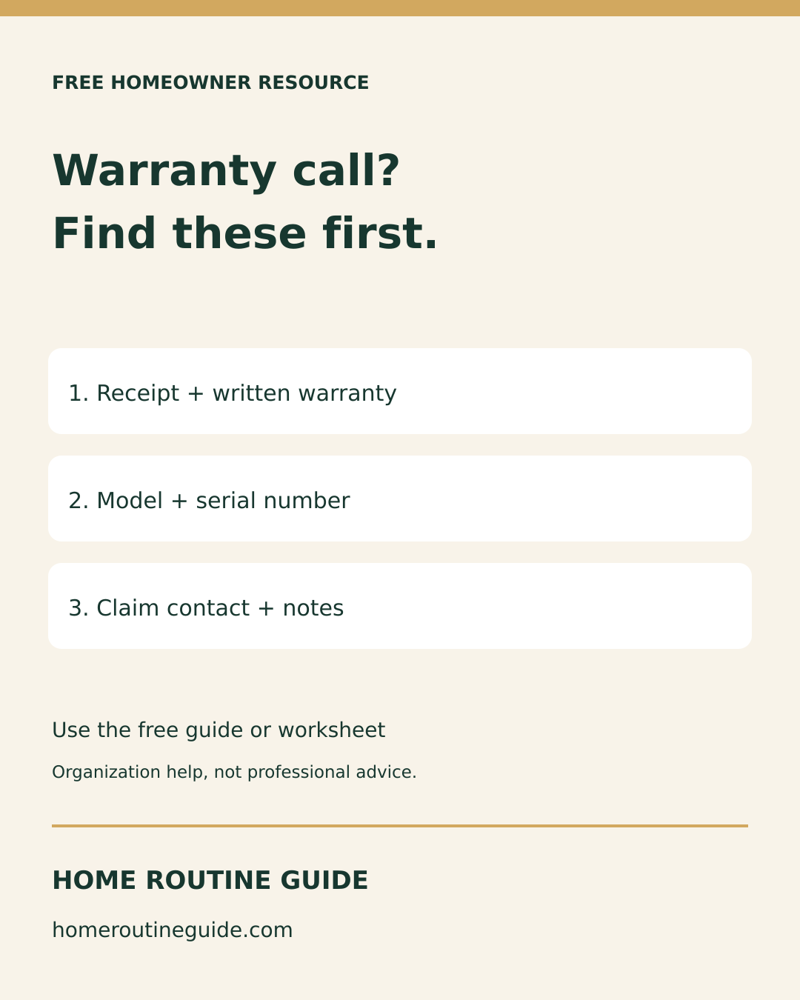
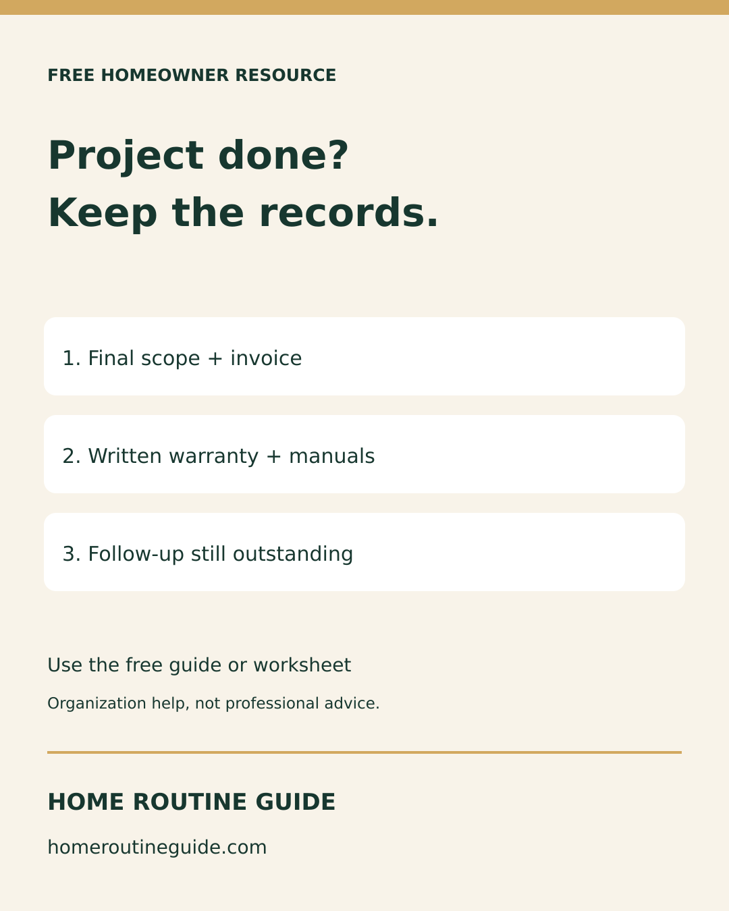

# September 21 Instagram preparation

Three original 1080×1350 feed cards, adapted separately from the Pinterest format. Free resources only; no product promotion. Scheduling/publication must be verified in Metricool, not inferred from this file.

## 2026-09-22T10:00:00-04:00

Two quotes can have different prices because they describe different jobs.

Before deciding, compare the written scope, materials, exclusions and completion date. Ask about anything missing. The FTC recommends getting multiple written estimates and not automatically choosing the lowest bidder.

Free guide: homeroutineguide.com → Free Checklists → How to Compare Contractor Estimates. The guide organizes questions; it does not verify or recommend a contractor.

#NewHomeowner #HomeProjects #HomeMaintenance

Destination: https://homeroutineguide.com/how-to-compare-contractor-estimates.html

## 2026-09-24T10:00:00-04:00

Before a warranty-service call, gather the receipt, written warranty, model and serial number, and claim contact.

Keep the originals securely. An organized record helps you find the details; it does not establish that a repair is covered. Follow the actual written terms.

Free recordkeeping guide: homeroutineguide.com → Free Checklists → Printable Home Warranty Tracker.

#NewHomeowner #HomeOrganization #HomeRecords

Destination: https://homeroutineguide.com/home-warranty-tracker-printable.html

## 2026-09-26T10:00:00-04:00

A finished home project still needs a record.

Keep the final scope and invoice, written warranty and manuals, and any remaining follow-up together. Record what actually happened, not what you assume.

Free worksheet: homeroutineguide.com → Free Checklists → Home Project Planner Printable. Type into the browser sheet or print a blank copy. Entries are not saved; print your own copy before leaving. Keep completed records private.

#HomeProjects #NewHomeowner #HomeOrganization

Destination: https://homeroutineguide.com/home-project-planner-printable.html#worksheet

## No-spend referral copy

Before comparing contractor prices, compare the written scope. Home Routine Guide offers a free comparison guide at https://homeroutineguide.com/how-to-compare-contractor-estimates.html and a browser-based comparison tool linked from the guide. Share the public link, not private completed records. This resource does not verify or endorse contractors.

Prepared for a resource list; no direct outreach or submission was made. No partnership or paid-product redistribution rights are implied.
