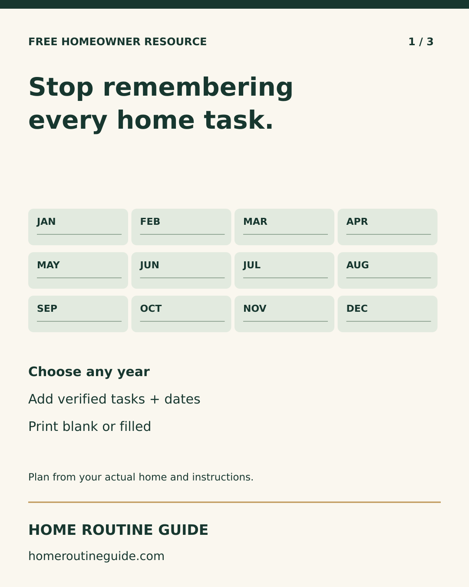
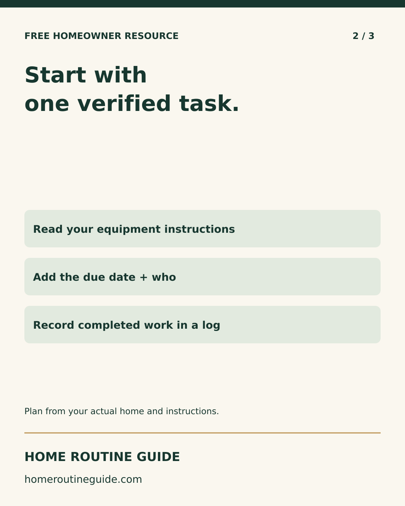
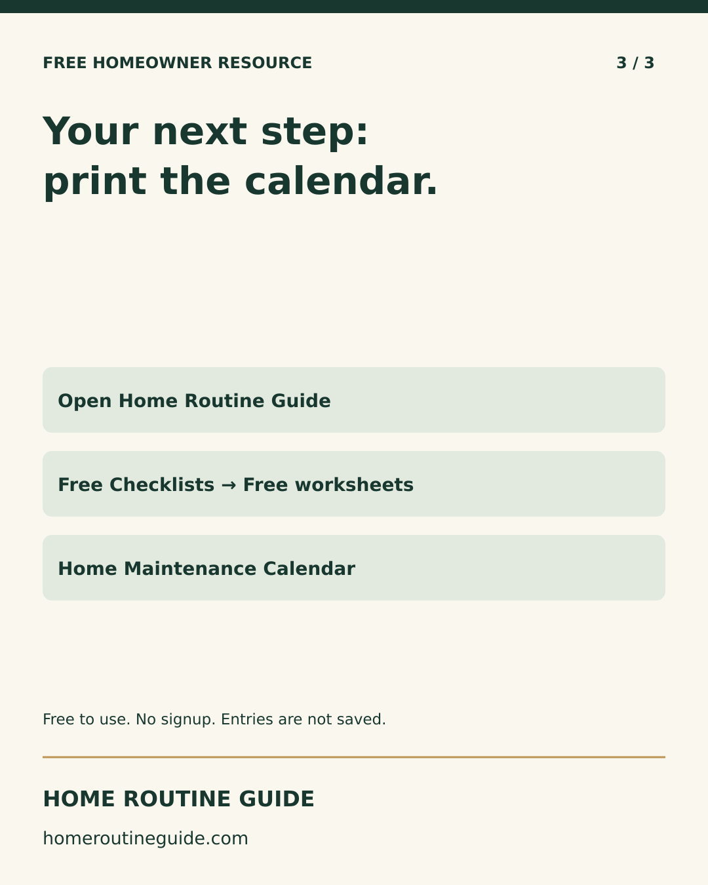
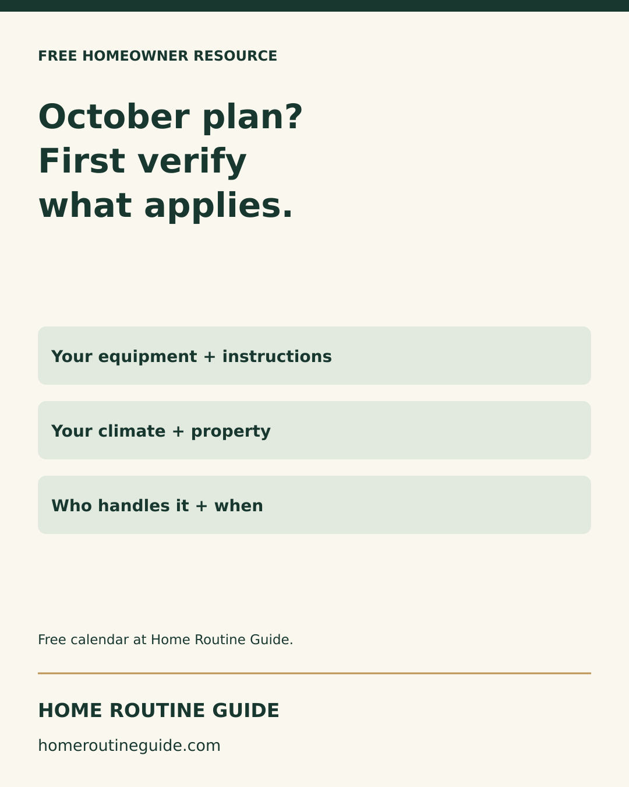
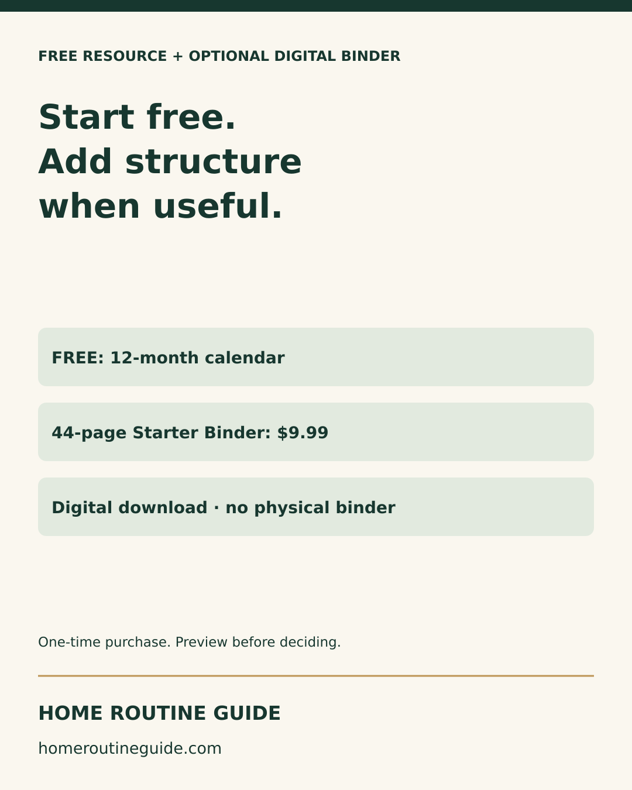

# Free-calendar Instagram campaign

Three distinct feed posts for the existing Home Routine Guide profile; 1080×1350 art. One carousel, two single-image posts. At most one product promotion. Dates below are intended until Metricool confirms them.

## 2026-09-29T10:00:00-04:00

A useful maintenance plan starts with your actual home.

Swipe for a simple way to begin: choose a year, verify one task from the right instructions, then record its date and who handles it. Leave months blank when you have nothing verified to add.

The free 12-month calendar lets you type short notes or print a blank copy. No signup required. Entries are not saved or submitted; print or save your own PDF before leaving.

Open homeroutineguide.com → Free Checklists → Free print-at-home worksheets → Home Maintenance Calendar Printable.

#NewHomeowner #HomeMaintenance #HomeOrganization

Destination: https://homeroutineguide.com/home-maintenance-calendar-printable.html#calendar-worksheet

## 2026-10-01T10:00:00-04:00

Your October home plan does not need every task on the internet.

Start with the equipment you actually own, your climate and property conditions, and any qualified service that is due. ENERGY STAR recommends professional pre-season HVAC checkups; follow your equipment instructions and use qualified help for technical work.

Use the fall checklist for prompts, then write verified tasks and dates in the free calendar. This is planning help, not a home inspection.

Open homeroutineguide.com → Free Checklists → Free print-at-home worksheets → Home Maintenance Calendar Printable.

#FallHomeMaintenance #NewHomeowner #HomePlanning

Destination: https://homeroutineguide.com/home-maintenance-calendar-printable.html#calendar-worksheet

## 2026-10-03T10:00:00-04:00

Start with the free calendar if an annual overview is all you need.

If you want guided pages for equipment, maintenance, repairs, contractors and budgets together, the New Homeowner Starter Binder is a 44-page digital download for a one-time $9.99. No physical binder is shipped.

Preview it at homeroutineguide.com → Starter Binder. Checkout opens on Kit; review the digital-product terms before purchasing. The free calendar remains available without a purchase.

#NewHomeowner #HomeOrganization #HomeMaintenance

Destination: https://homeroutineguide.com/packages.html

## No-spend resource-sharing copy

Planning your first year in a home? Print the free undated Home Routine Guide maintenance calendar: https://homeroutineguide.com/home-maintenance-calendar-printable.html#calendar-worksheet. Use your own equipment instructions and local conditions to choose tasks and dates. No purchase or signup is required. Share the public link rather than completed private records.

Prepared for welcome notes or a resource list. No outreach or submissions sent; no partnership, endorsement or paid-product redistribution rights implied.

Sources: https://www.energystar.gov/saveathome/heating-cooling/maintenance-checklist ; https://www.cpsc.gov/Safety-Education/Safety-Education-Centers/Carbon-Monoxide-Information-Center/CO-Alarms
