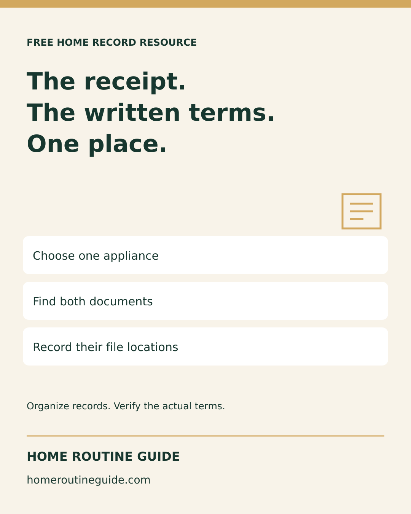
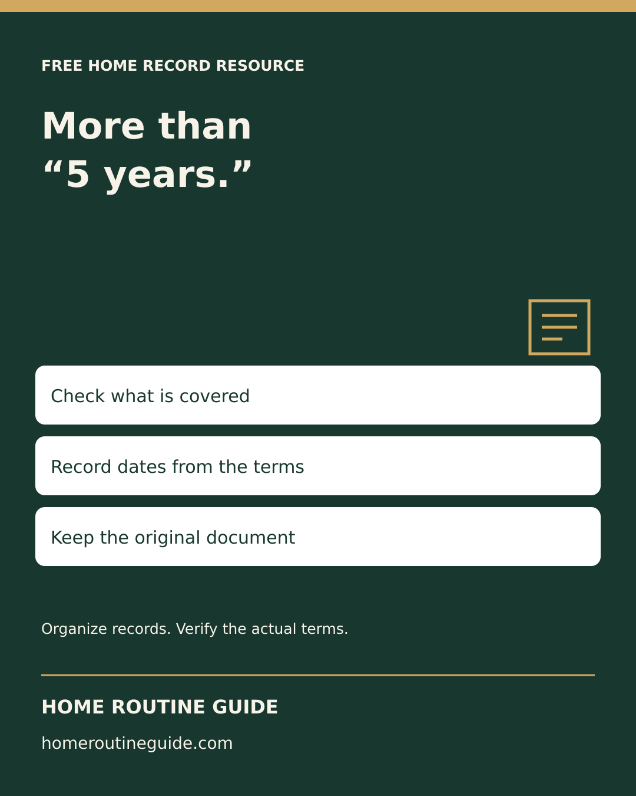

# Instagram and referral preparation — October 5, 2026

Two original 1080 × 1350 graphics, adapted for the feed. Prepared only; verify actual status in Metricool. Preserve the existing October 6 Reel. Suggested dates are October 8 and 10 at 10 a.m. America/New_York. Both posts feature free resources.

## receipt-meets-warranty

The receipt and the warranty belong together.

Pick one appliance. Find its receipt and written warranty, then record where both are stored. The FTC recommends keeping these documents together.

Our free blank warranty tracker gives you one sheet for document references, dates, claim contacts and next actions. Print it and fill it by hand. No signup required. It does not confirm coverage or send reminders.

Open homeroutineguide.com → Free Checklists → Printable organization guides → Printable Home Warranty Tracker → Print the free warranty tracker.

Keep completed records private.

#NewHomeowner #HomeRecords #HomeOrganization

Alt: Home Routine Guide: The receipt. The written terms. One place. Choose one appliance; Find both documents; Record their file locations. Organize records; verify the actual terms.

Destination: https://homeroutineguide.com/home-warranty-tracker-printable.html#warranty-worksheet

## more-than-five-years

“5 years” is a starting point, not a complete description of coverage.

Read the actual written terms. Note the covered item, dates, any different parts or labor terms, and the company to contact. If something is missing, mark it unknown and ask the appropriate provider.

A manufacturer warranty, builder warranty and separately purchased service contract may be different documents. Our free blank tracker helps keep the references together; it does not determine your rights or whether a repair is covered.

Open homeroutineguide.com → Free Checklists → Printable organization guides → Printable Home Warranty Tracker. No signup or purchase required.

#NewHomeowner #HomeMaintenance #HomeRecords

Alt: Home Routine Guide: More than “5 years.” Check what is covered; Record dates from the terms; Keep the original document. Organize records; verify the actual terms.

Destination: https://homeroutineguide.com/home-warranty-tracker-printable.html#warranty-worksheet

## Non-Pinterest resource-list copy

Home Routine Guide offers a free blank warranty worksheet for appliance receipts, written terms, coverage dates and claim contacts. Print one sheet per item and keep completed records private. No signup or purchase required.

Share the public destination: https://homeroutineguide.com/home-warranty-tracker-printable.html#warranty-worksheet

Prepared for welcome notes or resource lists; no outreach or submission sent. No partnership or permission to redistribute the paid household-use Binder is implied.

Sources: [FTC Warranties](https://consumer.ftc.gov/articles/warranties) and [FTC Warranties for New Homes](https://consumer.ftc.gov/articles/warranties-new-homes), reviewed October 5, 2026.
